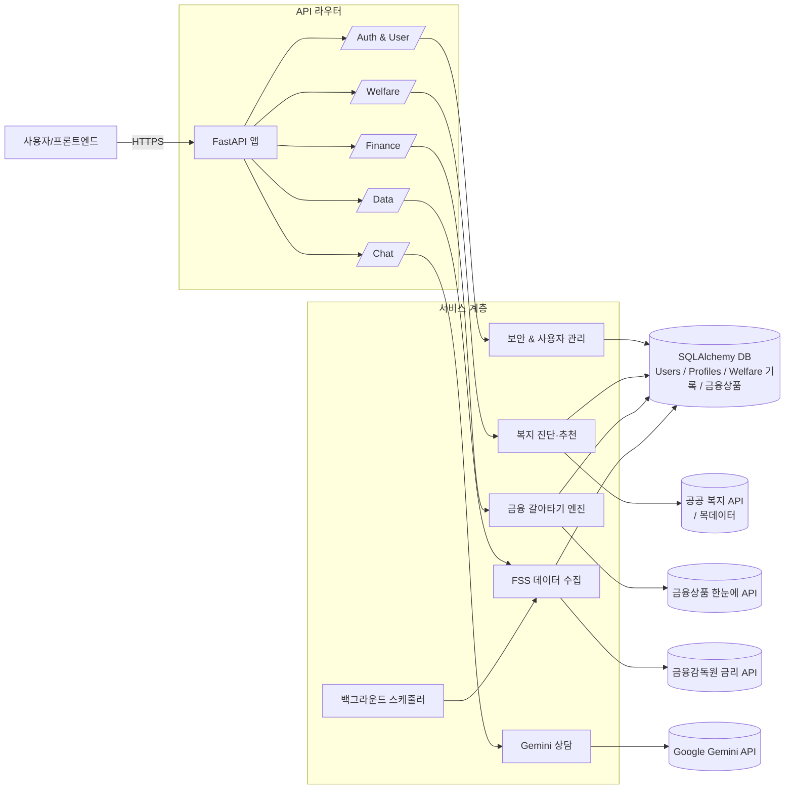
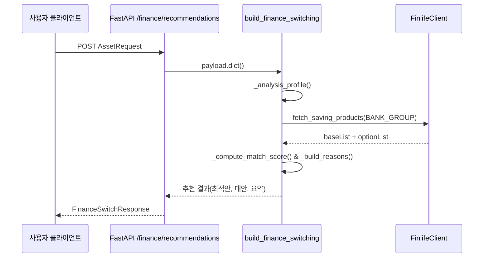

# WelFaren Backend 개발 문서

## 1. 아키텍처 개요
- **프레임워크**: FastAPI 기반의 단일 ASGI 애플리케이션으로 `app/main.py`에서 초기화한다. CORS 미들웨어는 모든 오리진/메서드/헤더를 허용하도록 등록되어 프론트엔드 개발 편의를 높인다.【F:backend/app/main.py†L1-L35】
- **라우터 구성**: 복지, 데이터, 인증, 사용자, 상담, 금융 도메인을 분리한 여섯 개의 `APIRouter` 모듈을 `/welfare`, `/data`, `/auth`, `/user`, `/chat`, `/finance` 프리픽스로 마운트한다.【F:backend/app/main.py†L21-L33】
- **백그라운드 스케줄링**: 기동 이벤트에서 `start_scheduler()`를 호출해 금융감독원(FSS) 데이터 갱신 작업을 6시간 주기로 예약한다.【F:backend/app/main.py†L29-L32】【F:backend/app/services/scheduler.py†L1-L13】

## 2. 런타임 & 환경 변수
- `.env`를 자동 로드하고, 미지정 시 합리적인 기본값을 사용한다. 예를 들어 DB는 `sqlite:///./backend.db`, JWT 만료는 60분, 복지/금융 API는 키가 없으면 목 데이터로 폴백한다.【F:backend/app/db/db_conn.py†L1-L26】【F:backend/app/services/security.py†L1-L35】【F:backend/app/services/welfare_provider.py†L1-L87】【F:backend/app/services/fss_service.py†L1-L24】
- Google Gemini, 금융감독원 ‘금융상품 한눈에’ API, 한국사회보장정보원 복지 API 등을 위한 환경 변수는 `backend/README.md`에 요약돼 있으며 운영 배포 시 필수다.【F:backend/README.md†L1-L42】

## 3. 데이터베이스 계층
- **세션 & 연결**: `db_conn.py`에서 SQLAlchemy 엔진과 세션팩토리를 생성하고, 금융상품 단순 테이블은 `Table` DDL로 즉시 생성한다. `save_financial_products()`는 기존 데이터를 제거 후 새로 삽입하는 전량 갱신 방식을 사용한다.【F:backend/app/db/db_conn.py†L1-L27】
- **ORM 모델**: `models.py`는 금융상품, 복지 진단 기록, 사용자, 사용자 프로필을 정의한다. 사용자 이메일은 유니크, 프로필은 사용자당 단일 레코드를 보장하는 `UniqueConstraint`를 사용한다.【F:backend/app/db/models.py†L1-L40】

## 4. 인증 & 사용자 관리
- **보안 유틸**: `security.py`가 PBKDF2-SHA256 비밀번호 해시/검증, HS256 기반 JWT 생성·복호화를 담당한다. 만료시간은 환경 변수로 조정 가능하다.【F:backend/app/services/security.py†L1-L35】
- **회원 가입/로그인**: `/auth/register`는 이메일 중복 검증 후 사용자 레코드를 생성하고 즉시 JWT를 발급한다. `/auth/login`은 자격 증명 확인 뒤 동일하게 토큰을 반환한다.【F:backend/app/api/auth_router.py†L1-L51】
- **프로필 조회**: `/auth/me`는 Bearer 토큰을 검증해 사용자 식별자를 확인하고, `/user/profile` GET/POST는 `get_current_user` 의존성으로 보호된다. 프로필은 존재 시 갱신, 미존재 시 생성하며 선호 카테고리는 리스트로 직렬화한다.【F:backend/app/api/auth_router.py†L53-L70】【F:backend/app/api/user_router.py†L1-L60】

## 5. 복지 진단 도메인
- **소득 인정액 계산**: `calculate_income_recognition()`은 월소득과 자산 환산소득(기본재산 공제 후 환산율 4% 적용)을 합산한다. 중위소득 대비 비율을 기준으로 Green/Yellow/Red 등급을 부여하고 당일 날짜를 결과에 포함한다.【F:backend/app/services/welfare_service.py†L1-L34】
- **진단 API**: `/welfare/diagnose`는 `WelfareInput`을 받아 계산 결과를 래핑해 반환한다.【F:backend/app/api/welfare_router.py†L1-L19】
- **외부 프로그램 공급자**: `welfare_provider.py`는 환경 변수에 따라 실제 공공데이터 API 또는 `welfare_samples.json` 목 데이터를 사용한다. 응답 구조 차이를 흡수하기 위해 프로그램 정보를 공통 포맷으로 매핑한다.【F:backend/app/services/welfare_provider.py†L1-L158】
- **추천 스코어링**: `recommend_welfare()`는 프로그램 목록을 가져와 `_score_program()`으로 선호 카테고리, 지역, 연령, 직업, 소득인정액 여부에 따라 가중치를 누적하고 점수순으로 정렬한다.【F:backend/app/services/welfare_recommendation.py†L1-L80】

## 6. 금융 데이터 파이프라인
- **FSS 데이터 수집**: `fetch_fss_deposit_products()`는 금융감독원 예·적금 금리 API를 호출해 pandas DataFrame으로 가공한 뒤 Dict 리스트로 반환한다. 비정상 응답 시 빈 리스트를 돌려 상위 로직에서 오류를 처리하게 한다.【F:backend/app/services/fss_service.py†L1-L24】
- **갱신 API**: `/data/refresh/fss`는 수집된 데이터를 DB에 저장하며, `/data/products`는 저장된 금융상품을 조회한다.【F:backend/app/api/data_router.py†L1-L26】
- **스케줄러**: `BackgroundScheduler`가 6시간마다 위 수집 로직을 실행하고, 성공 시 콘솔에 갱신 건수를 기록한다.【F:backend/app/services/scheduler.py†L1-L13】

## 7. 금융 갈아타기 추천 엔진
- **입력 모델**: `finance_router.py`가 Pydantic 스키마를 통해 자산·부채 입력을 검증하고 기본값을 0으로 보정한다.【F:backend/app/api/finance_router.py†L1-L64】
- **프로파일 분석**: `_analysis_profile()`은 적금 잔액·금리·남은 기간과 자산/부채 지표, 가구당 소득, 유동성 비율을 계산한다.【F:backend/app/services/finance_recommendation.py†L1-L86】
- **점수 산식**: `_compute_match_score()`는 금리 차, 만기 편차, 유동성, 부채 비율, 순이익 등을 조합해 0~100 점수를 산출하고, `_build_reasons()`는 금리/이자/패널티/만기/유동성/가입 경로 중심의 추천 사유를 만든다.【F:backend/app/services/finance_recommendation.py†L88-L165】
- **후보 산출**: `build_finance_switching()`은 금융감독원 옵션 데이터를 루프 돌며 후보를 생성하고, 매칭 점수·순이익·금리 순으로 정렬한 뒤 최적/대안, 요약 정보를 구성한다. 최상위 후보 순이익에 따라 “갈아타기 권장” 또는 “현재 상품 유지 검토” 액션을 부여한다.【F:backend/app/services/finance_recommendation.py†L167-L256】
- **Finlife API 클라이언트**: `FinlifeClient`는 금융감독원 ‘금융상품 한눈에’ REST API를 비동기로 호출하며, 페이지네이션을 `_fetch_all_pages()`에서 처리한다. API 키가 없으면 즉시 예외로 설정 오류를 노출한다.【F:backend/app/services/finlife_client.py†L1-L70】

## 8. Gemini 상담 서비스
- **데이터 모델**: `chat_service.py`는 상담 메시지(`ChatMessage`), 자산/소득/자격 스냅샷(`AssetSnapshot`, `IncomeRecognitionSnapshot`, `EligibilitySnapshot`)을 Pydantic 모델로 정의한다.【F:backend/app/services/chat_service.py†L1-L42】
- **모델 초기화**: `_get_model()`은 `GEMINI_API_KEY`와 선택적 모델명을 읽어 1회 캐시하며, 온도 0.2·top_p 0.8·최대 토큰 768 등 고정된 생성 설정을 사용한다.【F:backend/app/services/chat_service.py†L68-L101】
- **컨텍스트 주입**: `_render_context()`가 단계, 자산, 소득 인정액, 자격 정보를 한국어 요약 문자열로 변환해 대화 앞단에 삽입한다.【F:backend/app/services/chat_service.py†L103-L150】
- **대화 변환 & 호출**: `_convert_messages()`는 FastAPI 입력 메시지를 Gemini 형식으로 매핑한다. `generate_chat_reply()`는 컨텐츠가 없으면 400 오류를, Gemini 호출 실패 시 `ChatModelError`로 감싼 502 응답을 반환한다.【F:backend/app/services/chat_service.py†L152-L211】【F:backend/app/api/chat_router.py†L1-L36】

## 9. API 엔드포인트 요약
- `/welfare/diagnose`, `/welfare/recommendations`: 복지 진단 및 추천 제공.【F:backend/app/api/welfare_router.py†L1-L52】
- `/data/refresh/fss`, `/data/products`: 금융 상품 데이터 수집 및 조회.【F:backend/app/api/data_router.py†L1-L26】
- `/auth/register`, `/auth/login`, `/auth/me`: 기본 인증 흐름.【F:backend/app/api/auth_router.py†L23-L70】
- `/user/profile`: 사용자 선호도 저장/조회.【F:backend/app/api/user_router.py†L34-L60】
- `/chat/reply`: Gemini 상담사 응답 생성.【F:backend/app/api/chat_router.py†L1-L36】
- `/finance/recommendations`: 금융 갈아타기 추천 메인 엔드포인트.【F:backend/app/api/finance_router.py†L66-L99】

## 10. 운영 및 확장 고려 사항
- **오류 처리**: 외부 API 실패 시 목 데이터나 빈 리스트로 폴백해 서비스 지속성을 확보한다. Finlife/Gemini 키 누락은 초기화 단계에서 예외를 발생시켜 설정 오류를 빠르게 드러낸다.【F:backend/app/services/welfare_provider.py†L44-L158】【F:backend/app/services/finlife_client.py†L9-L70】【F:backend/app/services/chat_service.py†L68-L113】
- **비동기 I/O**: 금융 추천과 Gemini 상담은 비동기 클라이언트를 사용해 외부 호출 중 블로킹을 줄인다.【F:backend/app/services/finlife_client.py†L21-L70】【F:backend/app/services/chat_service.py†L174-L211】
- **데이터 지속성**: 금융상품 캐시는 SQLite를 기본으로 하며, `DATABASE_URL`을 통해 다른 RDB로 교체 가능하다.【F:backend/app/db/db_conn.py†L1-L23】
- **테스트/개발 모드**: 복지 목 데이터(`welfare_samples.json`)와 기본 환경 변수 덕분에 API 키 없이도 로컬에서 주요 흐름을 검증할 수 있다.【F:backend/app/data/welfare_samples.json†L1-L39】

## 11. 대표 다이어그램

### 11.1 서비스 아키텍처 개요
아래 다이어그램은 FastAPI 애플리케이션 중심의 주요 라우터·서비스·외부 연계 구조를 요약한다. 각 라우터는 `app/main.py`에서 프리픽스와 함께 등록되고, 서비스 계층은 내부 DB 또는 외부 API와 통신한다.【F:backend/app/main.py†L13-L34】【F:backend/app/api/welfare_router.py†L1-L62】【F:backend/app/api/data_router.py†L1-L27】【F:backend/app/api/finance_router.py†L1-L106】【F:backend/app/api/chat_router.py†L1-L36】【F:backend/app/api/auth_router.py†L1-L70】 금융감독원 데이터는 스케줄러가 주기적으로 갱신해 저장하며, 복지·금융 추천과 Gemini 상담은 각 서비스 모듈을 통해 외부 시스템과 상호작용한다.【F:backend/app/services/scheduler.py†L1-L14】【F:backend/app/services/fss_service.py†L1-L27】【F:backend/app/services/welfare_provider.py†L28-L138】【F:backend/app/services/finance_recommendation.py†L213-L349】【F:backend/app/services/chat_service.py†L67-L188】【F:backend/app/db/db_conn.py†L1-L29】【F:backend/app/db/models.py†L8-L49】

### 11.2 금융 갈아타기 추천 시퀀스
다음 시퀀스 다이어그램은 `/finance/recommendations` 요청이 처리되는 과정을 보여준다. 입력 스키마를 통과한 뒤 추천 엔진이 사용자 자산 프로파일을 산출하고, 금융감독원 ‘금융상품 한눈에’ API에서 적금 상품을 조회해 후보별 이자/순이익/점수를 계산한 뒤 응답을 생성한다.【F:backend/app/api/finance_router.py†L1-L106】【F:backend/app/services/finance_recommendation.py†L70-L349】【F:backend/app/services/finlife_client.py†L17-L96】

